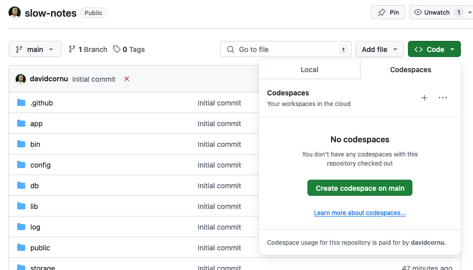

# README

This is a sample app to use as the basis for a talk on managing N+1 queries in Rails.

## Recommended setup

Start this repo in codespace



From the terminal you can then 
1. Install the dependencies

    ```bash
    bundle install
    ```
2. Setup the database
    ```bash
    rails db:setup
    ```
3. Load some sample data
    ```bash
    rails sample_data:generate
    ```

## During the talk

- Run the server with

    ```bash
    rails s
    ```
- Run the development console with

    ```bash
    rails c
    ```

## Useful links

- Strict mode: https://www.bigbinary.com/blog/rails-6-1-adds-strict_loading-to-warn-lazy-loading-associations
- `preload`, `eager_load`, `includes`, `joins`: https://www.bigbinary.com/blog/preload-vs-eager-load-vs-joins-vs-includes
- `count`, `length`, `size`: https://medium.com/unagi/ruby-on-rails-length-vs-size-vs-count-with-examples-a32e17274c79
0 
- Arel: 
    - https://github.com/rails/arel
    - https://devhints.io/arel